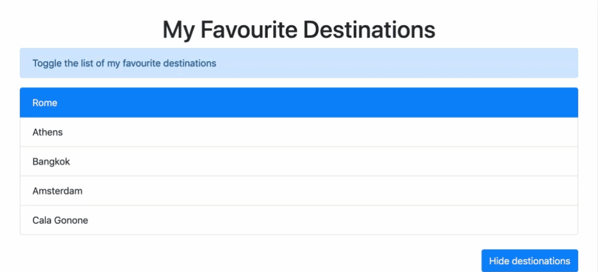

# Toggle Favourite Destinations

Create a list of your favourite destinations.

**Requirements:**
- use Bootstrap CDN to link to Bootstrap CSS
- use [Bootstrap list groups component](https://getbootstrap.com/docs/4.0/components/list-group/)
- use `Element.classList` methods

**Example:**

**Bonus:**

- Let the user select the favourite destination
- Show in the event object
- Style the list to your pleasing.

[//]: # (autograding info start)
#  Results
> ⌛ Give it a minute. As long as you see the orange dot  on top, CodeBuddy is still processing. Refresh this page to see it's current status.
>
> This is what CodeBuddy found when running your code. It is to show you what you have achieved and to give you hints on how to complete the exercise.

### Bootstrap CDN

|                 Status                  | Check                                                                                    |
| :-------------------------------------: | :--------------------------------------------------------------------------------------- |
|  | Bootstrap should be used |

### Hide destinations

|                 Status                  | Check                                                                                    |
| :-------------------------------------: | :--------------------------------------------------------------------------------------- |
|  | When button is clicked destinations should be alternately hidden and revealed |

[🔬 Results Details](../../actions)
[🐞 Tips on Debugging](https://github.com/DCI-EdTech/autograding-setup/wiki/How-to-work-with-CodeBuddy)
[📢 Report Problem](https://docs.google.com/forms/d/e/1FAIpQLSfS8wPh6bCMTLF2wmjiE5_UhPiOEnubEwwPLN_M8zTCjx5qbg/viewform?usp=pp_url&entry.652569746=Browser-ToggleItems)

[//]: # (autograding info end)